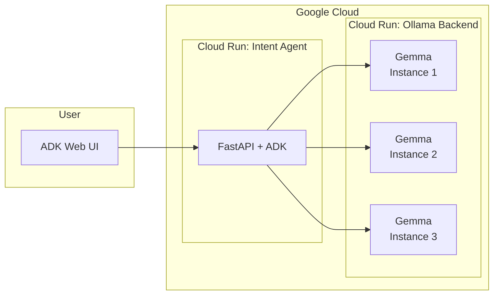

# Deploying Gemma Agents on Google Cloud Run with ADK

```ruby
               .:----------------:.               
            :=+**++++++++++++++++**+=:            
          :+*+=-..              ..-=+++:          
         -+++:                      :+++-         
        .+++                          +++.        
        -++-     :++:        :++:     -++-        
        -++-     :++:        :++:     -++-        
        :+++                          +++:        
         -+++.                      .=++-         
          :+*+=:..              ..:=+++:          
            -=+**+++++++++++++++++*+=-            
               ::----------------::.              
          ::::.                                   
        -%%%%%%-       :--       :-:              
        *%%+---      :=++=.      -+++-.           
        +%%-      .-=++=:         .-+++-.         
        +%%-     .++++:             .=+++:        
        +%%-      :=++=:           :=++=-         
        +%%=...     .=+++-       :=++=:           
        =%%%%%%-      .-==.      -==:             
                                  
```

## 1. Introduction

In this lab, you will deploy a production-ready **Agent Development Kit (ADK)** agent connected to a Gemma-family model backend on **Google Cloud Run**. The focus is on critical deployment patterns: setting up Cloud Run services, integrating model backends with ADK agents, and observing basic autoscaling behavior under load.

### Agenda:

By the end of this lab you will:

* Deploy a Gemma model backend to Cloud Run.
* Integrate the backend with an ADK agent.
* Test the agent with the ADK Web interface.
* Apply load testing to validate performance and autoscaling.
* Observe Cloud Run autoscaling behavior.

## 2. Project Setup

1. Sign in to the [Google Cloud Console](https://console.cloud.google.com/).
2. Ensure [billing](https://console.cloud.google.com/billing) is enabled for your project.
3. Create a new project or reuse an existing one.

💰 *Cost note*: Running this lab on CPU should stay under \$1 USD.

## 3. Open Cloud Shell Editor

Launch [Cloud Shell Editor](https://shell.cloud.google.com/). Click Authorize if prompted.

Open a terminal if it’s not already visible.

1. Check project list

   ```bash
   gcloud projects list | awk '/PROJECT_ID/{print $2}'
   ```

2. Set your project

   ```bash
   gcloud config set project [PROJECT_ID]
   export PROJECT_ID=$(gcloud config get-value project)
   ```

3. Enable APIs

   ```bash
   gcloud services enable \
     run.googleapis.com \
     artifactregistry.googleapis.com \
     cloudbuild.googleapis.com \
     aiplatform.googleapis.com
   ```

4. Set default region

   ```bash
   gcloud config set run/region europe-west1
   ```

## 4. Get the Starter Repository

Clone the starter repo:

```bash
git clone https://github.com/mayurmadnani/workshop-gcp-intent-to-agents
cd workshop-gcp-intent-to-agents
```

Check branches:

```bash
git branch -a
```

Each branch corresponds to a different agent persona:

* [kubectl-agent](https://github.com/mayurmadnani/workshop-gcp-intent-to-agents/tree/kubectl-agent)
* [markdown-agent](https://github.com/mayurmadnani/workshop-gcp-intent-to-agents/tree/markdown-agent)

Switch to one of the branch:

```bash
git checkout <agent-branch-name>
```

Project structure

```txt
workshop-gcp-intent-to-agents ➤ tree
.
├── README.md                # Project overview and instructions
├── adk-agent
│   ├── Dockerfile           # Container definition for the ADK agent service
│   ├── intent_agent         # Package containing the agent implementation
│   │   ├── __init__.py      # Marks directory as a Python package
│   │   └── agent.py         # Main agent logic
│   ├── load_test.py         # Locust script for load testing
│   ├── pyproject.toml       # Python dependencies and project metadata
│   └── server.py            # FastAPI server for the ADK agent
└── ollama-backend
    └── Dockerfile           # Container definition for the Gemma backend service
```

## 5. Architecture Overview

This lab uses a two‑service, decoupled architecture on Cloud Run. The services scale independently and communicate over HTTP.
* **Gemma Backend Service**: Hosts Gemma‑family models behind the Ollama HTTP API, handles inference requests and scales based on concurrent inference demand.
* **ADK Agent Service**: Exposes FastAPI endpoints, handles session management and routes requests.

Each service runs independently on Cloud Run and can scale separately.



## 6. Deploy the Gemma Backend

Navigate into the backend directory

```bash
cd ollama-backend
```
Choose a Gemma model

```bash
export GEMMA_MODEL="gemma3:4b"
```

Deploy to Cloud Run:

```bash
gcloud run deploy ollama-backend \
  --source . \
  --region europe-west1 \
  --concurrency 10 \
  --memory 12Gi \
  --cpu 6 \
  --no-cpu-throttling \
  --max-instances 3 \
  --min-instances 1 \
  --allow-unauthenticated \
  --set-env-vars OLLAMA_NUM_PARALLEL=4 \
  --timeout 300 \
  --labels workshop=ollama-backend
```

Save the service URL:

```bash
export OLLAMA_URL=$(gcloud run services describe ollama-backend \
    --region=europe-west1 \
    --format='value(status.url)')
```

## 7. Deploy the ADK Agent

Navigate into the agent directory

```bash
cd adk-agent
```

Set up environment configuration:

```bash
cat << EOF > .env
GOOGLE_CLOUD_PROJECT=$(gcloud config get-value project)
GOOGLE_CLOUD_LOCATION=europe-west1
GEMMA_MODEL_NAME=$GEMMA_MODEL
OLLAMA_API_BASE=$OLLAMA_URL
EOF
```

Deploy the agent:

```bash
gcloud run deploy adk-intent-agent \
   --source . \
   --region europe-west1 \
   --concurrency 10 \
   --memory 4Gi \
   --cpu 2 \
   --max-instances 1 \
   --allow-unauthenticated \
   --set-env-vars GOOGLE_CLOUD_PROJECT=$PROJECT_ID \
   --set-env-vars GOOGLE_CLOUD_LOCATION=europe-west1 \
   --set-env-vars GEMMA_MODEL_NAME=$GEMMA_MODEL \
   --set-env-vars OLLAMA_API_BASE=$OLLAMA_URL \
   --timeout 300 \
   --labels workshop=adk-intent-agent
```

Get the service URL:

```bash
export AGENT_URL=$(gcloud run services describe adk-intent-agent \
  --region=europe-west1 \
  --format='value(status.url)')
```

### Test the Agent

Check health endpoint:

```bash
curl $AGENT_URL/health
```

Open the `$AGENT_URL` in a browser to use the ADK Web UI. Test your agent out.
Alternatively, you can also proxy the Cloud Run Service to access on http://127.0.0.1:8080

```bash
gcloud run services proxy adk-intent-agent --port=8080
```


## 8. Load Testing

1. Install dependencies

   ```bash
   uv sync
   ```
2. Run load tests from the agent directory

   The below load test runs with 3 concurrent users at a spawn rate of 1 user/s for 60 seconds:

   ```bash
   uv run locust -f load_test.py \
      -H $AGENT_URL \
      --headless \
      -t 60s \
      -u 3 \
      -r 1
   ```

Observe [Cloud Run](https://console.cloud.google.com/run) autoscaling behavior:

* ADK Agent: Steady at 1 instance.
* Gemma Backend: This is the bottleneck service and with demand it scales up to handle inference load.

## 9. Clean Up

Delete resources to avoid charges:

```bash
gcloud run services delete adk-intent-agent --region=europe-west1
gcloud run services delete ollama-backend --region=europe-west1
```

## 10. Conclusion

🎉 You deployed a CPU-based Gemma agent on Cloud Run!

### What you achieved:

* Deployed a Gemma backend on Cloud Run.
* Integrated with an ADK agent.
* Validated via ADK Web interface.
* Ran load testing to observe scaling.

### Next steps:

* Try agents from other branches.
* Explore other Gemma models.
* Implement monitoring and alerting.
* Experiment with GPUs for inference improvements.

### Resources:
* [ADK Docs](https://google.github.io/adk-docs/)
* [Testing ADK Agents](https://google.github.io/adk-docs/get-started/testing/)
* [Ollama Gemma3 model card](https://ollama.com/library/gemma3)
* [Cloud Run GPU documentation](https://cloud.google.com/run/docs/configuring/services/gpu)
* [Gemma Instruction Tuning](https://ai.google.dev/gemma/docs/core/prompt-structure)

The workshop is inspired from [this](https://codelabs.developers.google.com/codelabs/cloud-run/how-to-connect-adk-to-deployed-cloud-run-llm) codelab.

---
